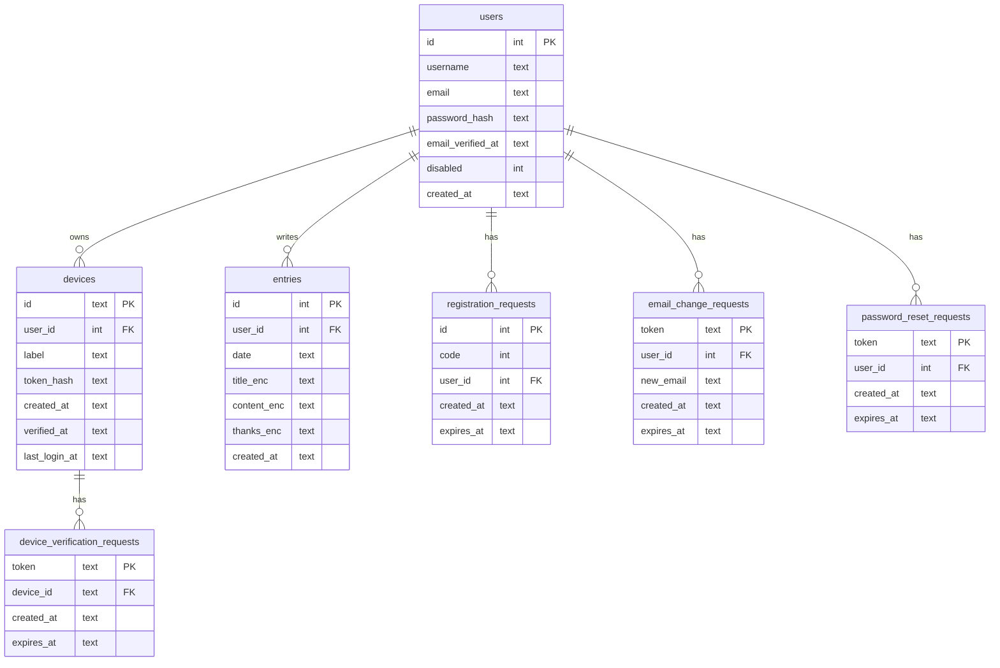

# Mind Echoes

_Capture your thoughts, reflect on your gratitude, and explore your mind, all in one secure space._

<https://mind-echoes.netlify.app>

## Screenshots

&nbsp;&nbsp;&nbsp;&nbsp;

 
 
 &nbsp;&nbsp;&nbsp;&nbsp;

## Description

This diary application is built with SvelteKit and SQLite. Diary entries, referred to as "echoes", can be created on a per-day basis. All entries are encrypted at rest in the database. The encryption is currently not zero-knowledge: decryption occurs on the application server using a fixed encryption key (https://github.com/ScriptRaccoon/mind-echoes/issues/1).

The application provides a full overview of all entries, with support for editing and straightforward navigation between days and entries.

User registration is intentionally split into three steps to improve usability. In the final step, users must enter a six-digit verification code sent to their email address. This is one of several account-level security features.

Authentication includes device-based access control. Logins from previously unregistered devices must be confirmed via an email verification link. All registered devices can be managed from the account settings page. Once a device is revoked, it is immediately prevented from making authenticated requests unless it is re-registered and verified. This significantly reduces the attack surface for unauthorized access.

Password resets are handled via time-limited email verification links.

Changing the account email address requires verification of the new address via an email link, while a notification is simultaneously sent to the existing email address. This dual-confirmation flow provides an additional layer of account security.

## Tech

As with most of my projects, external dependencies are kept to a minimum. The application is largely implemented from first principles using SvelteKit and SQLite, without relying on an ORM or a UI component library.

The following third-party libraries are used:

- `@libsql/client` - executes SQL queries against the SQLite database hosted on Turso
- `bcrypt` and `jsonwebtoken` - implement custom authentication and credential handling
- `lucide-svelte` - supplies the icon set
- `my-ua-parser` - generates human-readable device labels
- `nodemailer` - handles email delivery
- `valibot` - performs schema-based validation of all user input
- `@netlify/functions` — runs scheduled background tasks for regular database cleanup

## Database structure

